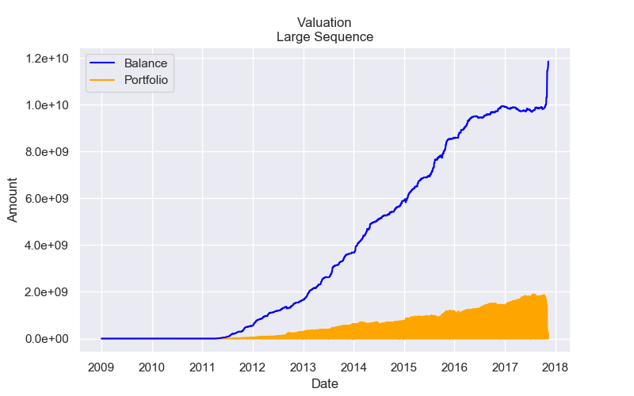
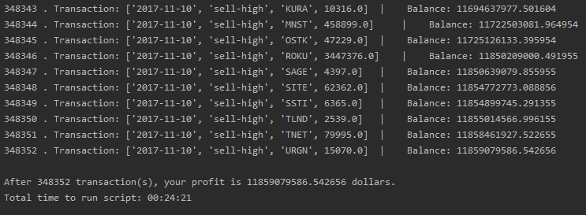

# Stock Market Time Travel Project
Simulation of stock transactions to make money as a time traveler who knows the historical daily prices and volumes of all U.S. stocks. Project for my MSc course "Programing tools for data science". The data used can be found at <https://www.kaggle.com/borismarjanovic/price-volume-data-for-all-us-stocks-etfs/version/3>.

### Valuation

### Code execution results

